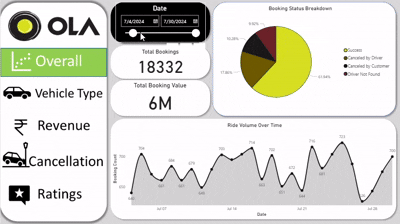
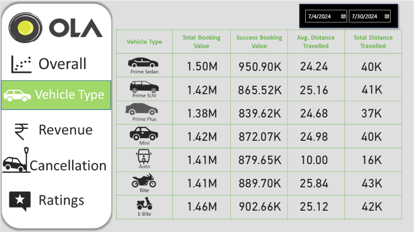
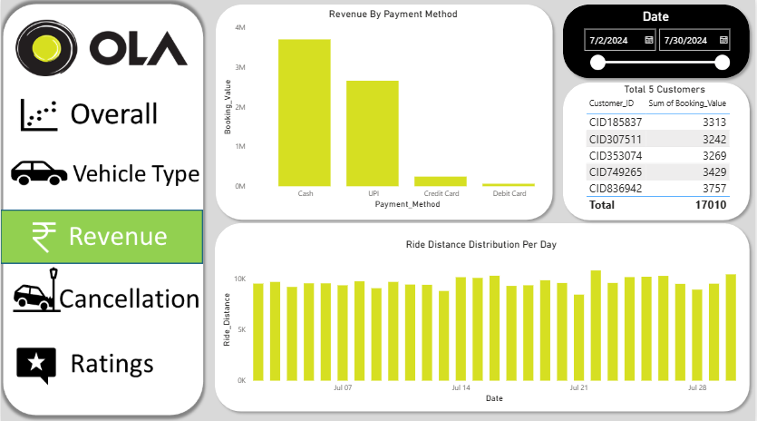
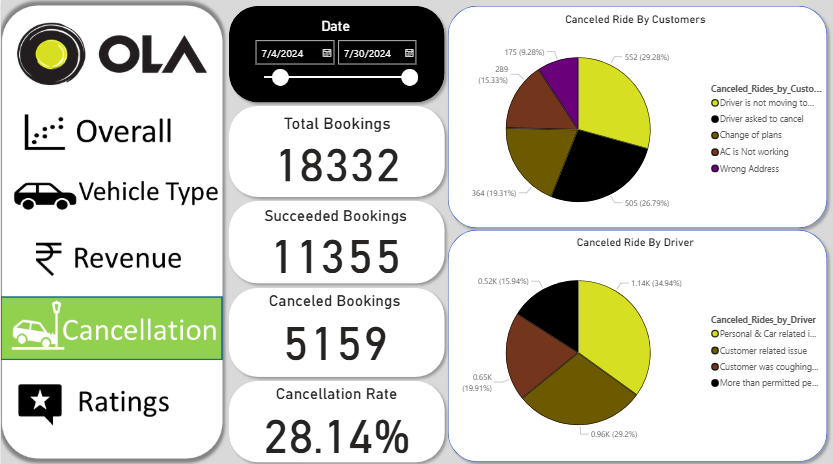
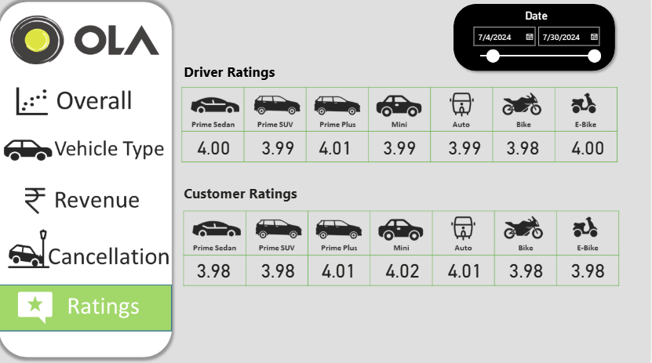

# 🚖 Ola Ride Data Analysis | SQL + Power BI Dashboard

## 📽️ Project Demo 



---


## 🔍 Project Overview
This project focuses on analyzing ride-booking data from a ride-hailing platform similar to Ola. The goal is to uncover operational inefficiencies, understand customer and driver behavior, and derive actionable insights to improve overall business performance.

The project was implemented using **SQL for data analysis** and **Power BI for interactive dashboard visualization**.

## 🎯 Objectives
- Analyze booking trends and ride performance  
- Identify key causes of ride cancellations  
- Evaluate revenue distribution across payment methods  
- Understand customer and driver behavior through ratings  
- Compare performance across different vehicle types  
- Build an interactive dashboard for business decision-making  

---

## 🗂️ Dataset Description
-  Dataset : [Link](https://docs.google.com/spreadsheets/d/11xMpK1Sbt-FwRPOYACD0p3sJmtH38634D4S2r_JtNjs/edit?usp=sharing)
- 📦 **Total Records:** 20,000  
- 📊 **Total Columns:** 19  

### Key Features:
- Booking ID, Date & Time  
- Booking Status (Success, Cancelled, Incomplete)  
- Customer ID  
- Vehicle Type (Prime Sedan, SUV, Mini, Auto, Bike, etc.)  
- Pickup & Drop Location  
- Cancellation Details (Customer & Driver with reasons)  
- Booking Value & Ride Distance  
- Driver Rating & Customer Rating  
- Payment Method (Cash, UPI, Card, etc.)


---

## ❗ Business Problem
Ride-hailing platforms often face challenges such as:

- High ride cancellation rates  
- Revenue loss due to incomplete rides  
- Lack of visibility into customer and driver behavior  
- Inefficient performance across vehicle categories  

👉 The objective of this project is to:
- Reduce cancellations  
- Improve customer satisfaction  
- Optimize revenue streams  
- Enhance operational efficiency  

---

## 🛠️ Solution Approach

### 🔹 SQL Data Analysis
Performed structured queries to extract meaningful insights:

## 📜 SQL Queries & Answers

### 1️⃣ Retrieve all successful bookings:

**📝 Query:**

```sql
CREATE VIEW Successful_Bookings AS
SELECT *
FROM bookings
WHERE Booking_Status = 'Success';
```

**📊 Answer:**

```sql
SELECT * FROM Successful_Bookings;
```
---

### 2️⃣ Find the average ride distance for each vehicle type:

**📝 Query:**

```sql
CREATE VIEW ride_distance_for_each_vehicle AS
SELECT Vehicle_Type, AVG(Ride_Distance) AS avg_distance
FROM bookings
GROUP BY Vehicle_Type;
```

**📊 Answer:**

```sql
SELECT * FROM ride_distance_for_each_vehicle;
```
---

### 3️⃣ Get the total number of cancelled rides by customers:

**📝 Query:**

```sql
CREATE VIEW cancelled_rides_by_customers AS
SELECT COUNT(*) AS total_cancelled_rides
FROM bookings
WHERE Booking_Status = 'cancelled by Customer';
```

**📊 Answer:**

```sql
SELECT * FROM cancelled_rides_by_customers;
```
---

### 4️⃣ List the top 5 customers who booked the highest number of rides:

**📝 Query:**

```sql
CREATE VIEW Top_5_Customers AS
SELECT Customer_ID, COUNT(Booking_ID) AS total_rides
FROM bookings
GROUP BY Customer_ID
ORDER BY total_rides DESC
LIMIT 5;
```

**📊 Answer:**

```sql
SELECT * FROM Top_5_Customers;
```

---

### 5️⃣ Get the number of rides cancelled by drivers due to personal and car-related issues:

**📝 Query:**

```sql
CREATE VIEW Rides_cancelled_by_Drivers_P_C_Issues AS
SELECT COUNT(*) AS cancelled_by_drivers
FROM bookings
WHERE cancelled_Rides_by_Driver = 'Personal & Car related issue';
```

**📊 Answer:**

```sql
SELECT * FROM Rides_cancelled_by_Drivers_P_C_Issues;
```

---

### 6️⃣ Find the maximum and minimum driver ratings for Prime Sedan bookings:

**📝 Query:**

```sql
CREATE VIEW Max_Min_Driver_Rating AS
SELECT MAX(Driver_Ratings) AS max_rating,
       MIN(Driver_Ratings) AS min_rating
FROM bookings
WHERE Vehicle_Type = 'Prime Sedan';
```

**📊 Answer:**

```sql
SELECT * FROM Max_Min_Driver_Rating;
```


---

### 7️⃣ Retrieve all rides where payment was made using UPI:

**📝 Query:**

```sql
CREATE VIEW UPI_Payment AS
SELECT *
FROM bookings
WHERE Payment_Method = 'UPI';
```

**📊 Answer:**

```sql
SELECT * FROM UPI_Payment;
```


---

### 8️⃣ Find the average customer rating per vehicle type:

**📝 Query:**

```sql
CREATE VIEW AVG_Cust_Rating AS
SELECT Vehicle_Type, AVG(Customer_Rating) AS avg_customer_rating
FROM bookings
GROUP BY Vehicle_Type;
```

**📊 Answer:**

```sql
SELECT * FROM AVG_Cust_Rating;
```


---

### 9️⃣ Calculate the total booking value of rides completed successfully:

**📝 Query:**

```sql
CREATE VIEW total_successful_ride_value AS
SELECT SUM(Booking_Value) AS total_successful_ride_value
FROM bookings
WHERE Booking_Status = 'Success';
```

**📊 Answer:**

```sql
SELECT * FROM total_successful_ride_value;
```


---

### 🔟 List all incomplete rides along with the reason:

**📝 Query:**

```sql
CREATE VIEW Incomplete_Rides_Reason AS
SELECT Booking_ID, Incomplete_Rides_Reason
FROM bookings
WHERE Incomplete_Rides = 'Yes';
```

**📊 Answer:**

```sql
SELECT * FROM Incomplete_Rides_Reason;
```
---

## 📊 Power BI Dashboard


## 📸 Dashboard Preview

### 🔹 Overall Dashboard


**Highlights:**
- Total Bookings & Total Booking Value  
- Booking Status Breakdown  
- Ride Volume Trends over Time  

---

### 🚗 Vehicle Type Analysis


**Insights:**
- Booking Value by Vehicle Type  
- Average & Total Distance Travelled  
- Performance comparison across categories  

---

### 💰 Revenue Analysis


**Insights:**
- Revenue distribution by payment methods  
- Top 5 customers by booking volume  
- Ride distance patterns  

---

### ❌ Cancellation Analysis


**Insights:**
- Total vs Cancelled Bookings  
- Cancellation Rate  
- Customer vs Driver cancellations  
- Cancellation reasons  

---

### ⭐ Ratings Analysis


**Insights:**
- Driver Ratings across vehicle types  
- Customer Ratings trends  
- Service quality evaluation  

---

## 📈 Key Insights

- 🚨 High cancellation rate (~28%) indicates operational inefficiency  
- 👤 Customers cancel rides mainly due to delays or plan changes  
- 🚗 Drivers cancel rides due to personal or vehicle-related issues  
- 💳 UPI and Cash dominate revenue contribution  
- 🚘 Prime and Bike categories show strong booking performance  
- ⭐ Ratings remain stable (~4.0), indicating consistent service quality  
- 🔁 Top customers contribute significantly to total bookings  
- 📊 Ride demand fluctuates across days  

---

## 🚀 Future Enhancements

- Integrate real-time data to optimize ride dispatching.
- Analyze customer feedback for service improvement.
- Compare OLA’s performance with competitors to identify market gaps.
---

## 🧰 Tools & Technologies
- SQL (MySQL / PostgreSQL)  
- Power BI  
- Data Cleaning & Transformation  
- Data Visualization  

---


